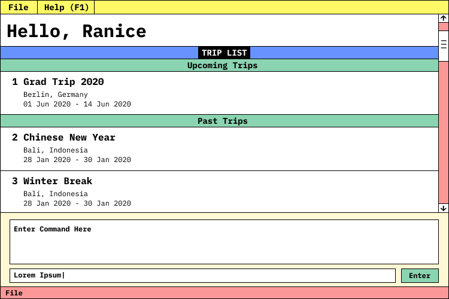

= Volant
ifdef::env-github,env-browser[:relfileprefix: docs/]

https://travis-ci.org/se-edu/addressbook-level3[image:https://travis-ci.org/AY1920S2-CS2103T-F09-4/main.svg?branch=master[Build Status]]

ifdef::env-github[]

endif::[]

ifndef::env-github[]
image::images/Ui.png[width="600"]
endif::[]

* This is a simple travel planning application to assist beginner solo travellers on their travels. It has a GUI but most of the user interactions happen using a CLI (Command Line Interface).
* It is  written in Java 11 using object oriented programming.

== Site Map

* <<UserGuide#, User Guide>>
* <<DeveloperGuide#, Developer Guide>>
* <<LearningOutcomes#, Learning Outcomes>>
* <<AboutUs#, About Us>>
* <<ContactUs#, Contact Us>>

== Acknowledgements

* This application's base code is based off the Address Book application developed by the CS2103T team for the CS2103T software engineering module.
* Libraries used: https://openjfx.io/[JavaFX], https://github.com/FasterXML/jackson[Jackson], https://github.com/junit-team/junit5[JUnit5]

== Licence : link:LICENSE[MIT]
