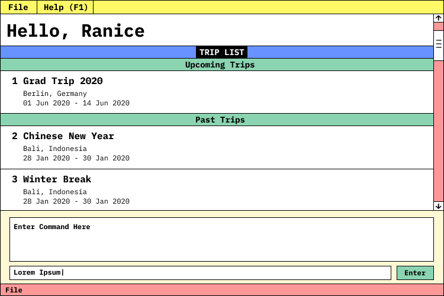

ifndef::env-github[]

endif::[]

https://travis-ci.org/github/AY1920S2-CS2103T-F09-4/main[image:https://travis-ci.org/AY1920S2-CS2103T-F09-4/main.svg?branch=master[Build Status]] image:https://api.codacy.com/project/badge/Grade/88d0a6f6f3d54309a5fd560383e7f780[link="https://app.codacy.com/gh/AY1920S2-CS2103T-F09-4/main?utm_source=github.com&utm_medium=referral&utm_content=AY1920S2-CS2103T-F09-4/main&utm_campaign=Badge_Grade_Dashboard"] https://coveralls.io/github/AY1920S2-CS2103T-F09-4/main[image:https://coveralls.io/repos/github/AY1920S2-CS2103T-F09-4/main/badge.svg[Coverage Status]]

ifndef::env-github[]

endif::[]

* This is a simple travel planning application to assist beginner solo travellers with the logistics of their travels.
* It has a GUI but most of the user interactions happen using a CLI (Command Line Interface).
* It is  written in Java 11 using object oriented programming.

== Site Map

* <<UserGuide#, User Guide>>
* <<DeveloperGuide#, Developer Guide>>
* <<LearningOutcomes#, Learning Outcomes>>
* <<AboutUs#, About Us>>
* <<ContactUs#, Contact Us>>

== Acknowledgements

* This application's base code is based off the Address Book application developed by the CS2103T team for the CS2103T software engineering module.
* Libraries used: https://openjfx.io/[JavaFX], https://github.com/FasterXML/jackson[Jackson], https://github.com/junit-team/junit5[JUnit5]

== Licence : link:LICENSE[MIT]
